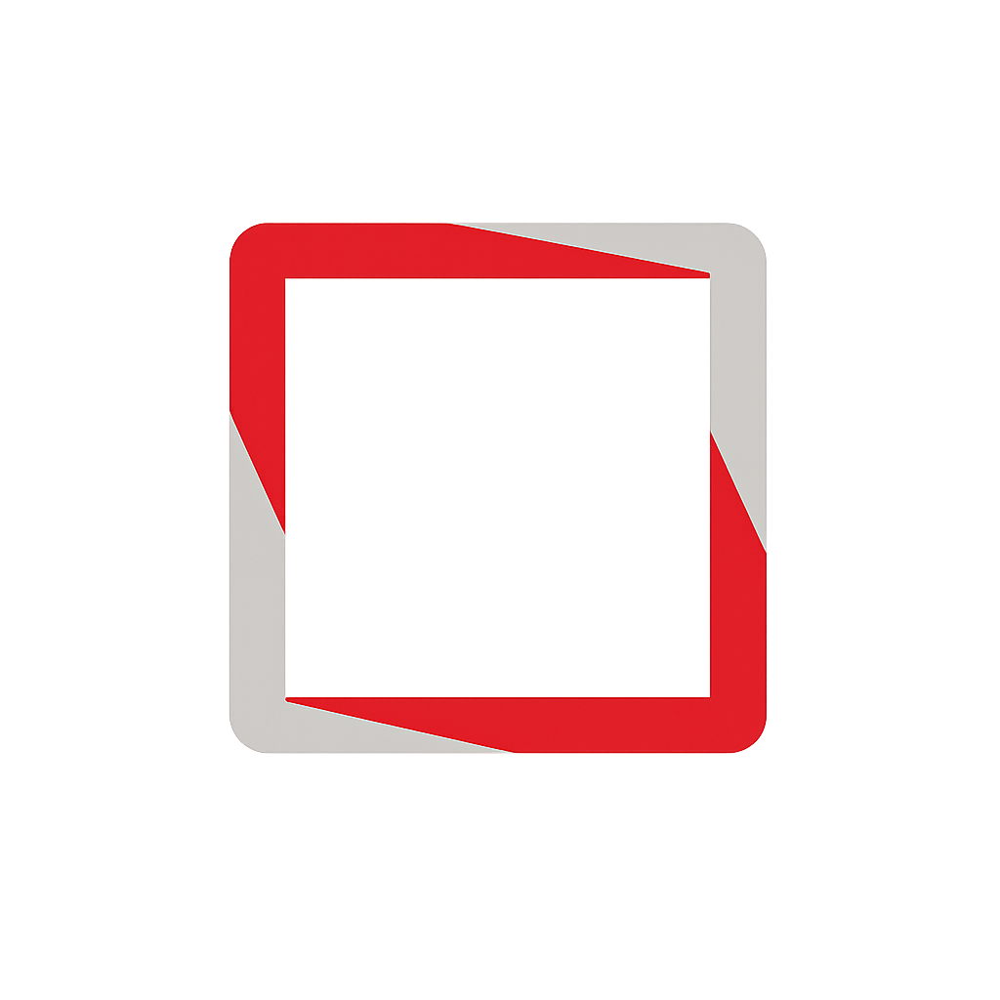

<p align="center">
  
</p>

<h1 align="center">Arxiv Map</h1>

---

<p align="center">A personal 3D map of your ArXiv research library, powered by AI.</p>

<p align="center">
  <a href="#features">Features</a> · <a href="#setup">Setup</a> · <a href="#stack">Stack</a>
</p>

---

## Features

- **3D paper map** — All your saved papers laid out in a navigable 3D space, clustered by topic using Claude.
- **AI summaries** — Claude generates structured summaries (TL;DR, contributions, methodology, findings) for any paper.
- **AI chat** — Ask questions about a specific paper or your entire map. The map chat can highlight and navigate to relevant papers.
- **Paper feed** — Discover new work via AI-powered recommendations based on your library, plus the latest ArXiv submissions.
- **Paper reader** — Read any ArXiv paper with a persistent chat sidebar for questions and context.

---

## Setup

### 1. Clone and install

```bash
git clone https://github.com/your-username/arxivmap.org
cd arxivmap.org
npm install
```

### 2. Environment variables

Create a `.env.local` file:

```env
NEXT_PUBLIC_SUPABASE_URL=your_supabase_url
NEXT_PUBLIC_SUPABASE_ANON_KEY=your_supabase_anon_key
SUPABASE_SERVICE_ROLE_KEY=your_service_role_key
ANTHROPIC_API_KEY=your_anthropic_api_key
```

### 3. Database

Run the migrations in `supabase/migrations/` against your Supabase project, in order.

### 4. Run

```bash
npm run dev
```

---

## Stack

- **Framework** — [Next.js 16](https://nextjs.org) (App Router, server actions)
- **Database & auth** — [Supabase](https://supabase.com) (Postgres + Row Level Security + OAuth)
- **AI** — [Claude](https://anthropic.com) via `@anthropic-ai/sdk` (summaries, chat, map clustering)
- **3D rendering** — [Three.js](https://threejs.org) + [React Three Fiber](https://docs.pmnd.rs/react-three-fiber)
- **Styling** — [Tailwind CSS v4](https://tailwindcss.com)
- **Deployment** — [Vercel](https://vercel.com)
